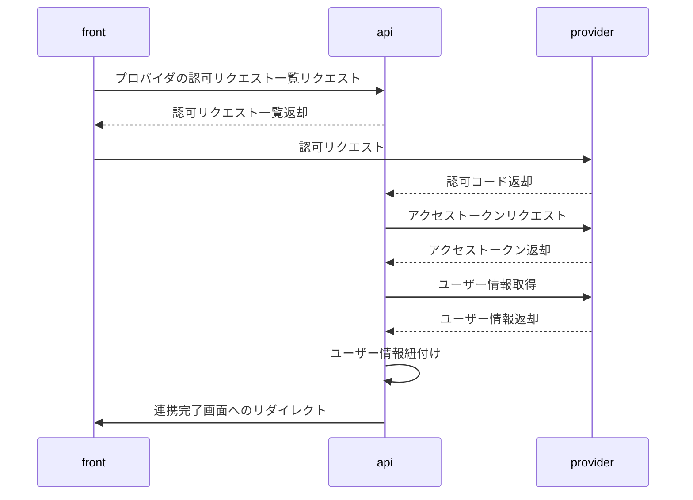
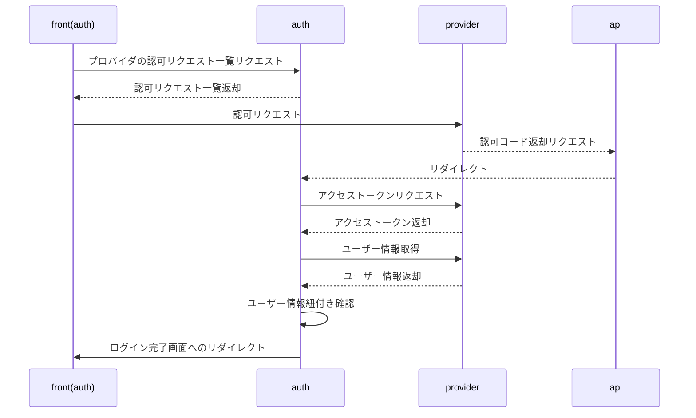

# secure-stream

認証機能を持つアプリケーション

## 構成

[secure-stream-front](https://github.com/k-narusawa/secure-stream-front/tree/main)のバックエンド部分

### 機能

* ログイン認証
* ソーシャルログインによる認証
* PassKeyによる認証

## 初期設定

* サブモジュールの設定

```shell
git -C secure-stream-openapi config core.sparsecheckout true

# 確認コマンド
# `core.sparsecheckout`がtrueになっていることを確認する
git -C secure-stream-openapi config -l

# /kotlin-spring/ のみ記載
code .git/modules/secure-stream-openapi/info/sparse-checkout

git -C secure-stream-openapi read-tree -mu HEAD
```

## OpenAPIのRedoc

[リポジトリ](https://github.com/k-narusawa/secure-stream-openapi)

[ReDoc](https://k-narusawa.github.io/secure-stream-openapi)

## ソーシャルログイン

### 連携


### 認証
